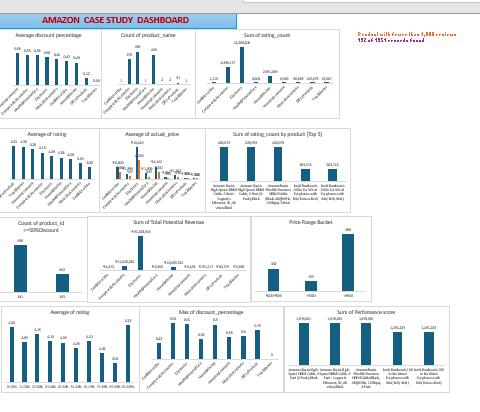

# Amazon-Case-Study
DSA Capstone Project-Amazon Product Review Analysis using Excel (Pivot Tables, Charts, and Dashboard).
# PROJECT TOPIC: Amazon Case Study
This project focuses on analysing Amazon product listings using Excel to uncover insights through Pivot Tables and a dashboard.

## Data Source
The dataset used for this analysis contains product-level information from Amazon, including:
- Product name and category
- Actual and discounted prices
- Ratings and review counts
- Product links and other metadata
- Discount percentage and product_id

## Tools Used
- Excel - for data cleaning, pivot table analysis, and dashboard creation

  ## Data Cleaning & Preparation
 The following steps were taken to prepare the data for analysis:
 1. Creating the category within the main category and sub-category
 2. Removing blank rows and columns
 3. Added calculated fields:
    - Potential Revenue = Actual price * Review Count
    - Price Range Bucket  =IF([@[discounted_price]]<200,"<₹200",IF(OR([@[discounted_price]]=200,[@[discounted_price]]<=500),"₹200-₹500",">₹500"))
    - Discount Bucket =IF([@[discount_percentage]]<=10%,"0-10%",IF([@[discount_percentage]]<=20%,"11-20%",IF([@[discount_percentage]]<=30%,"21-30%",IF([@[discount_percentage]]<=40%,"31-40%",IF([@[discount_percentage]]<=50%,"41-50%",IF([@[discount_percentage]]<=60%,"51-60%",IF([@[discount_percentage]]<=70%,"61-70%",IF([@[discount_percentage]]<=80%,"71-80%",IF([@[discount_percentage]]<=90%,"81-90%","91-100%")))))))))
    - >50% discount =IF([@[discount_percentage]]>=50%,"YES","NO")
   - Performance Score = Rating * review count

## Analysis Performed
A total of 14 business questions were answered using Pivot Tables and formulas:

1. Average discount percentage by category
2. Number of products in each category
3. Total reviews per category
4. Products with the highest average ratings
5. Average actual vs discounted price by category
6. Products with the most reviews
7. Count of products with >_ 50% discount
8. Rating distribution
9. Potential revenue by category
10. Product count per price range
11. Rating vs discount trend
12. Products with <1,000 reviews
13. Categories with the highest discount
14. Top 5 products by performance score

## Dashboard
A full dashboard was created in Excel featuring: All the questions answered

## [Dashboard Preview]

      
